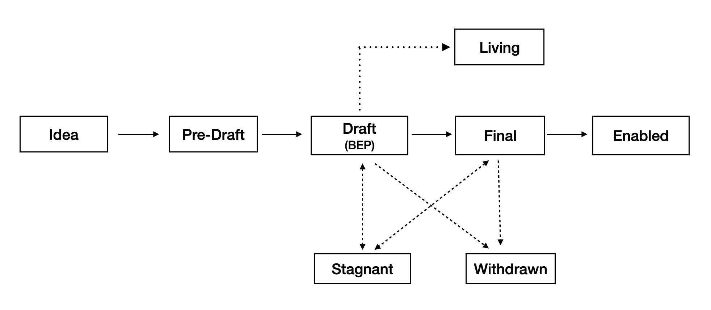

<pre>
  BEP: 1
  Title: Purpose and Guidelines
  Status: Living
  Type: Process
  Created: 2019-04-11
</pre>

# BEP 1: Purpose and Guidelines

opBNB is a layer-2 scaling solution for the BNB Smart Chain, constructed on the foundation of decentralized governance and driven by the aspirations of its community. This Provisional Governance Framework provides the structure for sustainable, adaptable, and democratic governance that's built to endure and evolve.

Recognizing the complexity and unpredictability of the future, opBNB embarks on this journey with a Provisional Governance Framework that will adapt and grow iteratively over time. The Framework will be reassessed and refined every four years to accommodate lessons learned and new dynamics within the ecosystem.

The BNB Foundation, an autonomous organization, will coordinate the growth and development of opBNB. The Foundation will manage governance operations, allocate treasury assets for ecosystem growth, amend the Provisional Governance Framework, and gradually transition its responsibilities to the community, fostering a more decentralized model over time.

- [BEP 1: Purpose and Guidelines](#bep-1-purpose-and-guidelines)
  - [1. What is BEP?](#1-what-is-bep)
  - [2. Rights and Responsibilities of BNB Community](#2-rights-and-responsibilities-of-bnb-community)
  - [3. BEP Rationale](#3-bep-rationale)
  - [4. BEP Types](#4-bep-types)
  - [5. BEP Workflow](#5-bep-workflow)
  - [6. BEP Format](#6-bep-format)
  - [7. opBNB and Progress](#7-opbnb-and-progress)
  - [8. Reference](#8-reference)
  - [9. License](#9-license)

## 1. What is BEP?

BEP stands for BNB Chain Evolution Proposal. Each BEP will be a proposal document providing information to the BNB Chain community, both BNB Beacon Chain and BNB Smart Chain. The BEP should provide a concise technical specification of the feature or improvement and the rationale behind it. Each BEP proposer is responsible for building consensus within the community and documenting dissenting opinions. Each BEP has a unique index number.

## 2. Rights and Responsibilities of BNB Community

BNB communities are granted the right to participate in the ecosystem's decision-making processes. This includes the right to propose and vote on significant changes, delegate their decision-making rights to others, and receive delegation from others, ensuring a sense of collective ownership and participatory democracy. (more information regarding voting process will be provided in a follow-up article)

## 3. BEP Rationale

BEP is the primary mechanism for proposing new features, for collecting community technical input on issues, and for documenting the design decisions that go into BNB Chain. Because BEPs are maintained as text files in a versioned repository, their revisions are the historical records of feature proposals.

For BNB Chain contributors, it is a convenient way to track the progress of their implementation by BEPs. It will help end users to know the status of a given feature, function or improvement.

## 4. BEP Types

There are three types of BEP:

- **Standards**: A Standards BEP describes functional changes on BNB Chain, such as a change to the network protocol, proposer selection mechanism in consensus algorithm, change in block size or fee mechanism in application level. It will effect the implementation of BNB Chain.
- **Information**: An Information BEP will clarify some concepts of the BNB Chain, it may not effect the BNB Chain client implementation.
- **Process**: This kind of proposal will change the workflow of BNB Chain working process, like this BEP itself.

## 5. BEP Workflow

*Figure 1: BEP workflow*

Once the idea is accepted, each status change is requested by the BEP author and reviewed by the BEP editors. Use a pull request to update the status.

- **Idea**: If you have an idea but not sure if it worths a BEP or not, you may discuss with the community first before you put too much effort. You may post your idea in [bnb chain forum](https://forum.bnbchain.org/) and visit the [bep-discussion channel in our discord](https://discord.gg/bnbchain) to let the community know it.
- **Pre-Draft**: If your idea is accepted, it is still not a BEP yet. A formal document will be needed to describe your idea, the Pre-Draft document should follow the BEP format. And you need to create a pull request and the BEP editors will review it.
- **Draft**: Once the Pre-Draft pull request is accepted by the community and reviewed by the BEP editors, it can be merged. The pull request number will be used as the BEP number, which means it is a legal BEP now. The BEP editors will add the status, then it will be recorded and maintained by the community. The BEP author should keep pushing it forward, the author can update the BEP by creating new pull requests.
- **Final**: This proposal is finalized and a reference implementation should be provided.
- **Enabled**: This proposal is enabled in BNB Chain mainnet, if it is a hard fork, the fork number has reached.

Other exceptional statuses include:

- **Living**: A BEP will be long-term maintained, like this BEP.
- **Stagnant**: A BEP has not been updated for more than 6 months, it will enter Stagnant state.
- **Withdrawn**: A BEP that is dropped and will not be implemented. Usually, it is due to some prerequisite conditions that are not true anymore.

## 6. BEP Format

It is important to keep BEP clear and well organized, BEPs need to follow this format(BEP1 is excepted):

- Preamble: a short metadata about the BEP, it should be put at the top of the BEP. Here is an example:

<pre>
  BEP: 127
  Title: Temporary Maintenance Mode for Validators
  Status: Enabled
  Type: Standards
  Created: 2022-01-10
  Author(optional): it can be a name or an email.
  Description(optional): enabled by BSC Euler upgrade, block height 18907621, Jun-22-2022
  Discussions(optional): could be a link to the bnb forum, where it is discussed.
</pre>

- Summary: a very short summary with a single sentence, someone could understand the purpose of the BEP by reading it even without technical background.
- Abstract(optional): a short paragraph to give more introduction about the BEP, could be multi-sentence. Someone could read the abstract to know the general workflow of the BEP.
- Motivation: it is a critical part of the BEP, it should explain very clearly why this proposal is needed.
- Specification: it is another critical part, the detail workflow and configuration need to be provided. Diagrams are needed to make it easy to be understood if it is hard to be described in text.
- Rational(optional): it adds more information to support the specification, i.e. why the design in the specification is preferred.
- Forward Compatibility(optional): if the BEP will introduce compatibility problems in the future, probably because of some scheduled changes in the future that would be broken by the BEP. In such case, this part is a must to describe the detail incompatibilities and how to deal with it.
- Backward Compatibility(optional): similar to Forward Compatibility, if the BEP introduces compatibility problems to the previous or current system, then this part is a must to describe the detail incompatibilities and how to deal with it.
- Reference Implementations(optional): before the BEP enters the Final state, a reference implementation will be needed. However, if the BEP does not need a implementation, it can be omitted.
- License: to show the copyright of the BEP.

## 7. opBNB and Progress

opBNB is committed to positive and progressive development. We believe in the power of our community to overcome challenges and create a more inclusive, efficient, and prosperous ecosystem.

This Provisional Governance Framework is a foundation for shaping our unique governance model that aligns with opBNB's needs and vision. It's a living document, subject to refinement through community feedback and shared decision-making.

## 8. Reference

Ethereum Improvement Proposals:  [https://github.com/ethereum/EIPs](https://github.com/ethereum/EIPs/blob/master/EIPS/eip-1.md)

Bitcoin Improvement Proposals:  <https://github.com/bitcoin/bips>

## 9. License

All the content are licensed under [CC0](https://creativecommons.org/publicdomain/zero/1.0/).
